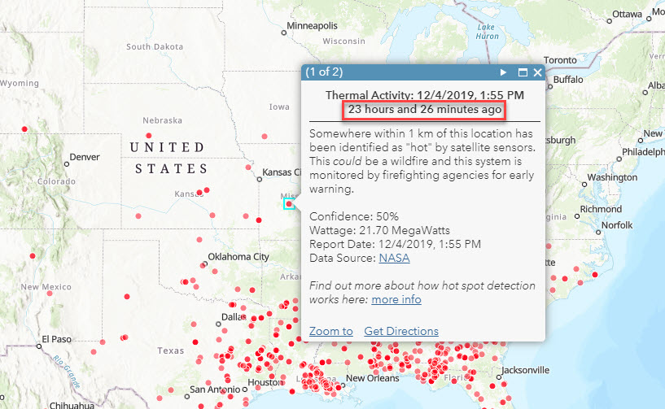

# Relative Time Stamp

This expression converts a time field into a relative time display (e.g. 9 days and 19 hours ago).

## Use Cases

To create a richer popup experience where temporal data is more easily understand based on when an event occured relative to now.

## Workflow

Copy and paste the expression found in the expression template below to the Arcade editor in ArcGIS Online, the relevant location in ArcGIS Pro, or the relevant location in a custom app.

To configure the script to your layer, edit the first line to specify the field name you would like to use instead of the example `Date`.

```js
var myDateField = $feature["Date"];
```

## Expression Template
Below that, paste this Arcade expression. It will do the work convert your date field into a relative timestamp

```js
function getTimeDelta(alertDate){
    var minutes = DateDiff(now(),alertDate, "minutes")
    var hours = DateDiff(now(),alertDate, "hours")
    var days = DateDiff(now(),alertDate, "days")
    if (minutes <= 120){
        return round(minutes) + " minutes"
    }
    if (minutes > 120){
        if (hours <= 48){
            var tFloor = floor(hours)
            var deltaMin = datediff(now(),dateadd(alertDate,tFloor,'hours'),'minutes')
            return round(tFloor) + " hours and " + round(deltaMin) +  " minutes"
        }
        if (hours > 48){
            var dFloor = floor(days)
            var deltaHour = datediff(now(),dateadd(alertDate,dFloor,'days'),'hours')
            return round(dFloor) + " days and " + round(deltaHour) + " hours"
        }
    }
}
return getTimeDelta(myDateField)
```

## Modifying the Template
This template assumes some thresholds for desired display that can be tweaked as needed. It assumes, for example, that minutes greater than 120 should be converted to hours and that hours greater than 48 should be converted to days.

## Example Output

 f
